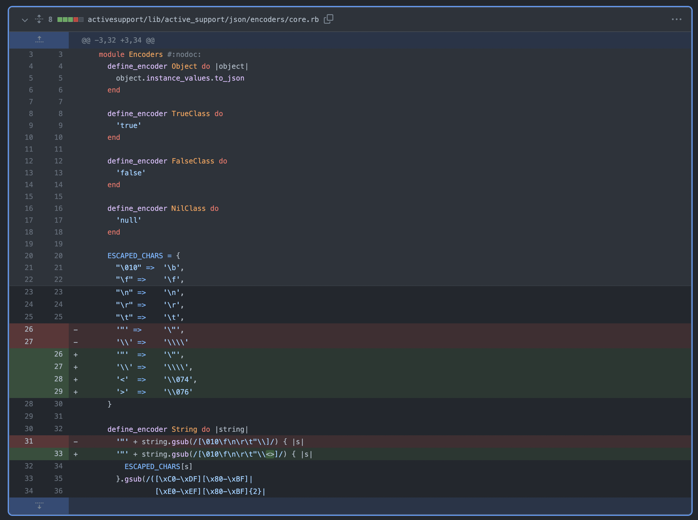

##  Major News Stories
* OpenSSL is in the news again, this time with a memory corruption vulnerability, "[potentially] worse than Heartbleed in an isolated severity assessment." This quotes is from a [blog post](https://guidovranken.com/2022/06/27/notes-on-openssl-remote-memory-corruption/) by Guido Vranken, which has an excellent overview of the issue. Thankfully, it only affects systems with AVX512 support and none of the popular OpenSSL alternatives like LibreSSL, BoringSSL, etc. are affected. The issue is expected to be fixed in OpenSSL version 3.0.5.
* As a reminder, CWE stands for "Common Weakness Enumeration" and, "Is a community-developed list of common software and hardware weakness types that have security ramifications." A CWE differs from CVE in that CWE can be thought of as a class of vulnerability, whereas a CVE is a specific vulnerability in software that is identified by a unique ID. This week, the CWE team released the, "Top 25 Most Dangerous Software Weaknesses list (CWE™ Top 25). This list demonstrates the currently most common and impactful software weaknesses. Often easy to find and exploit, these can lead to exploitable vulnerabilities that allow adversaries to completely take over a system, steal data, or prevent applications from working." The list is available [here](https://cwe.mitre.org/about/index.html) and contains some notable changes from 2021, including SQL injection moving up 3 places in the list.
* A few interesting deep-dive reads from the week:
  * [Introducing New Ways to Verify Age on Instagram](https://about.fb.com/news/2022/06/new-ways-to-verify-age-on-instagram/)
  * [A wide range of routers are under attack by new, unusually sophisticated malware](https://arstechnica.com/information-technology/2022/06/a-wide-range-of-routers-are-under-attack-by-new-unusually-sophisticated-malware/)

## Other Software with Critical Patches Available
* [Jenkins patched a number of critical issues](https://www.jenkins.io/security/advisory/2022-06-22/).

## Learning -- `CVE-2007-3227`: Part 1
On June 14, 2007, the San Antonio Spurs edged the Cleveland Cavaliers 83-82 for a 4-0 series sweep to win the NBA Finals. While probably not as widely known, this day also saw the disclosure of the third ever Ruby on Rails CVE: `CVE-2007-3227`.

The NIST disclosure for this CVE reads, "Cross-site scripting (XSS) vulnerability in the to_json (ActiveRecord::Base#to_json) function in Ruby on Rails before edge 9606 allows remote attackers to inject arbitrary web script via the input values." [1] As a quick refresher, "XSS attacks occur when an attacker uses a web application to send malicious code, generally in the form of a browser side script, to a different end user. Flaws that allow these attacks to succeed are quite widespread and occur anywhere a web application uses input from a user within the output it generates without validating or encoding it." [2]

The [GitHub diff](https://github.com/rails/rails/compare/v1.2.4...v1.2.5#diff-debc9b4d3ae8db53949f488775540f0792ec334405a809b8c418580efbe93dcf) for the `activesupport/lib/active_support/json/encoders/core.rb` file in Rails versions 1.2.4 (this version and earlier are vulnerable) and 1.2.5 (fixed version) shows where the attack originates:

As can be seen in the above picture, prior to Rails 1.2.5, the `<` and `>` characters were not being escaped. Given that these characters are used in JavaScript `` tags, it's easy to see how failing to properly sanitize them could lead to _major_ issues.

As a bonus, here's a short Google Groups post on the exploit that's a fun throwback: [https://groups.google.com/g/rubyonrails-security/c/A0x3ZspNVQU](https://groups.google.com/g/rubyonrails-security/c/A0x3ZspNVQU)

[1] [https://nvd.nist.gov/vuln/detail/CVE-2007-3227](https://nvd.nist.gov/vuln/detail/CVE-2007-3227)  
[2] [https://owasp.org/www-community/attacks/xss/](https://owasp.org/www-community/attacks/xss/)  

## Sources & Resources
In addition to inline citations, the following were used or referenced when preparing this debrief.
* [https://isc.sans.edu/podcast.html](https://isc.sans.edu/podcast.html)
* [https://www.onthisday.com/date/2007/june/14](https://www.onthisday.com/date/2007/june/14)
* [https://cwe.mitre.org/about/index.html](https://cwe.mitre.org/about/index.html)

----

Thanks for reading, stay safe out there, and have a great weekend! 👩🏿‍💻 🌐 👨🏽‍💻
