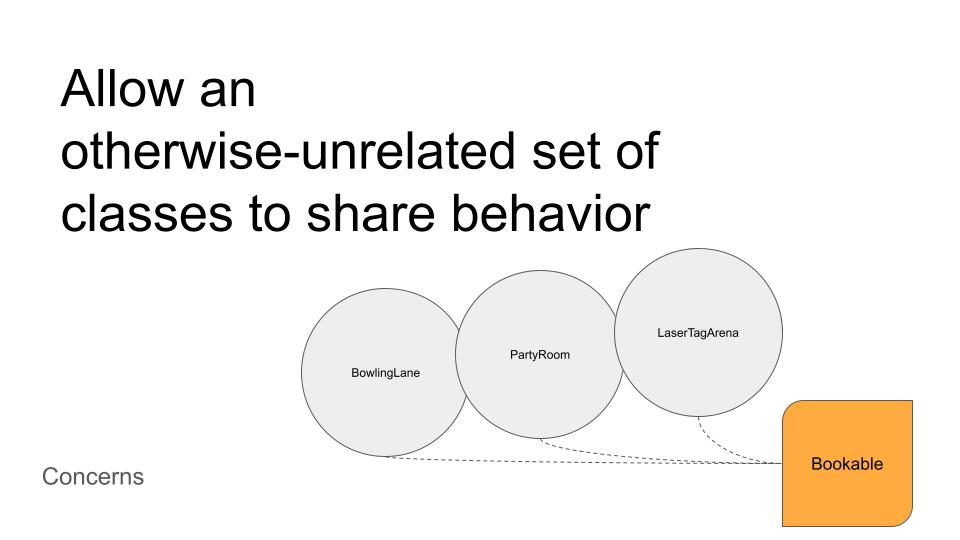
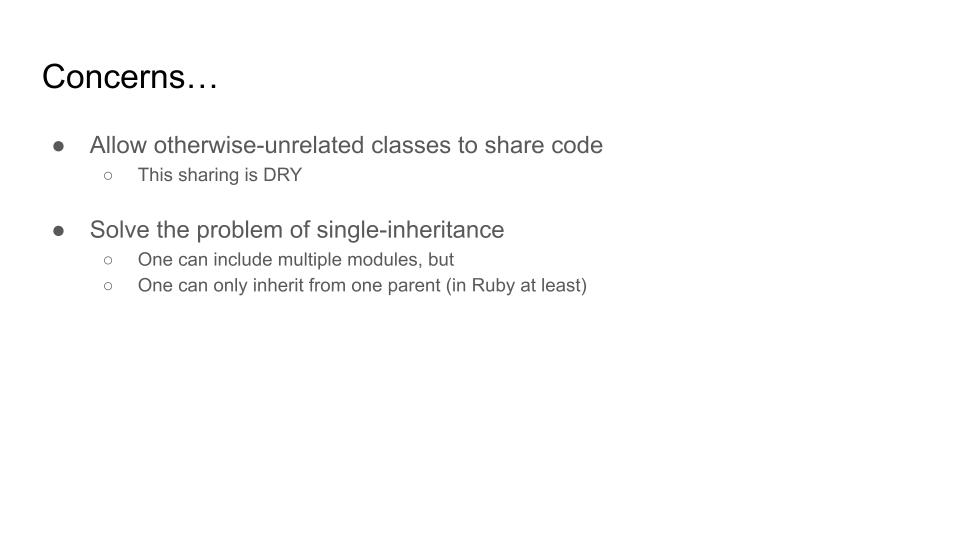
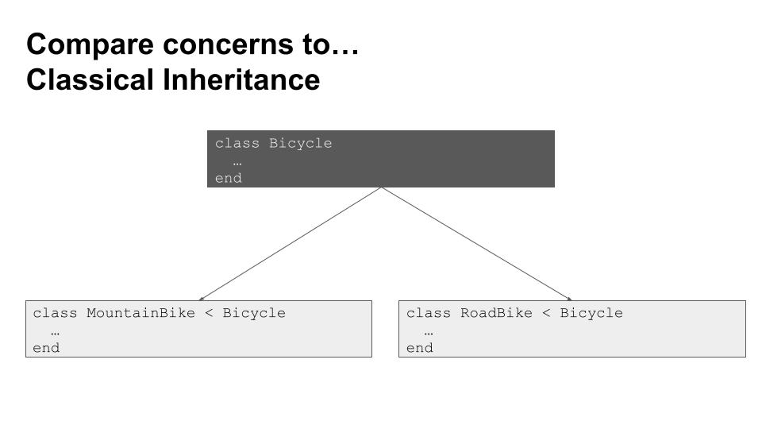
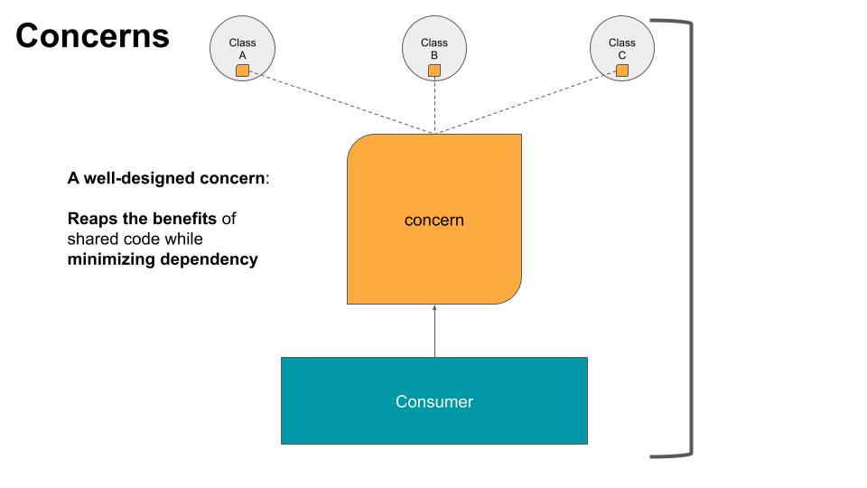

In October of 2022, I had the privilege of giving a talk on "Concerns (aka. modules) in Ruby" to the Maxwell development team and afterwards was asked if I could condense my talk into a blog post.

Well, I unfortunately failed at the "condense" part as we'll need several posts to cover everything, but I am excited to present the talk to you in written format and hope that you find it entertaining if not educational.

***

To begin, let's orient ourselves - what are concerns/modules (hereinafter concerns) in Ruby? When you see the word "concern" in this series moving forward, we are talking about the following:

Broadly-speaking, **concerns are a mechanism for allowing an otherwise-unrelated set of classes to share code**. In Ruby, they are created using the `module` keyword and in Rails apps they can live in multiple locations but conventionally are found in directories like `app/models/concerns`, `app/controllers/concerns`, etc.

As an example of one place we might use a concern, say we're working on an app for managing a "family fun park" type of business that has a laser tag arena, party rooms, and bowling lanes, and we want to allow our customers to book or reserve any and all of these. We can accomplish this behavior via a `Bookable` concern that adds scheduling functionality to any class that includes it.

You'll often see concerns referred to as mix-ins because their functionality gets "added to" or "mixed into" the classes that include them. Also note that classes aren't limited to just one concern - they can include as many as they want!

The code sharing made possible by concerns is DRY ("don't repeat yourself") and solves the problem of single inheritance since classes, in Ruby at least, can only have one parent class.

Let's look at some diagrams to help us visualize concerns by comparing them to the more well-known concept of inheritance.

This first diagram depicting classical inheritance should be pretty self-explanatory to anyone familiar with the concept:

Now, here's a diagram that depicts how concerns work:

Hopefully, as you look at the above, a little red flag is waving around annoyingly in your mind. Hopefully, as you examine these diagrams, you are hit with the fact that in both we are looking at _relationships_ between classes, but the relationship created by inheritance is much more explicit/obvious than the relationship that's created when we use a concern.

In short:

> The **hierarchical** nature of **inheritance** creates relationships between classes, and these relationships are **explicit**.
>
> The **mixed-in** nature of **concerns** also creates relationships between classes, but these relationships are **implicit**.

And it's at this point that I'm going to take what will probably feel like a (long) detour, but please hang with me. This tangent is necessary because:

> Knowing what something _is_ or what it _does_ does NOT mean that we understand how to use it well!

As Lego Gandalf said:

So for now:

----

Let's take that detour and begin by asking ourselves...

## _What is the primary goal of good software design?_

I'm sure this is one of those questions that philsophers could debate about for centuries, but for our purposes I want to take a bit less of your time and submit to you the idea (not original to me) that the primary goal of good software design is...

> _To reduce the cost of change_.

Above, the word "cost" is not limited to monetary concerns. It encompasses the ideas of financial investment, time spent, the amount of human-power required, etc. to deliver working software.

Furthermore, allow me to clarify the statement that, "the primary goal of good software design is to reduce the cost of change," with two axioms that should ring true to anyone who's worked with a software program of any decent size for more than a few months:

> 1. Change is **inevitable**...so it must be taken into account.
>
> 2. Change is **unknowable**...so it needs to be made inexpensive, _not_ guessed at.

In regards to point #2 above, it's actually considered a design sin to try to predict and build for change ahead of time since doing so a) easily leads to maintaining unused code added in case of "what if" and b) can easily lead to time and effort wasted building the wrong thing.

So, yes - **change is coming** and we therefore need to **make it as inexpensive as possible**. This is the primary goal of good software design, and it means that ***good software design is one of the most practical things in the world***. It is focused, not on glass houses and castles in the clouds, but on making the real-world experience of software development safer, better, and, ultimately, less expensive.

So how do we do this? How do we build software in such a way that change is as inexpensive as possible?

One way is via the use of time-tested software design principles which allow us to stand on the shoulders of giants and learn from their hard-won wisdom:

> Don't reinvent the wheel because we already have pretty good wheels and honestly your car isn't Google-sized anyway and neither is your budget so seriously just stop.
>
> *Ada Lovelace* (probably)

These "time-tested software design principles" are where we'll pick up in part two. See you there!