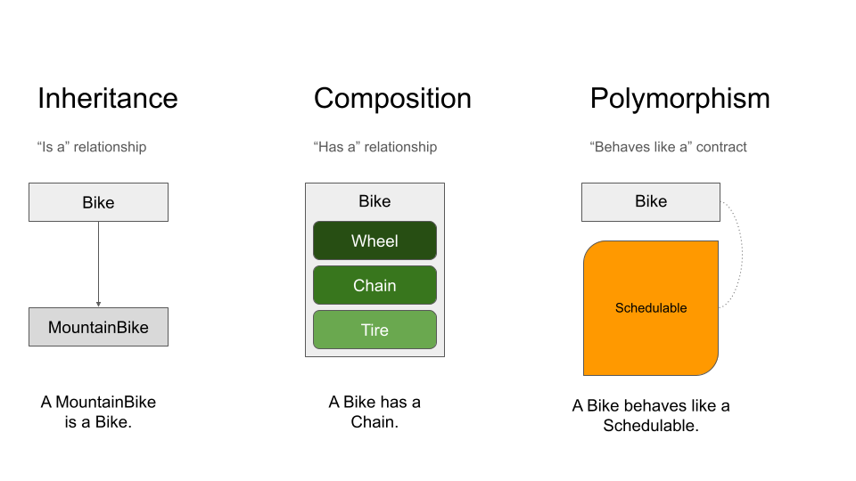
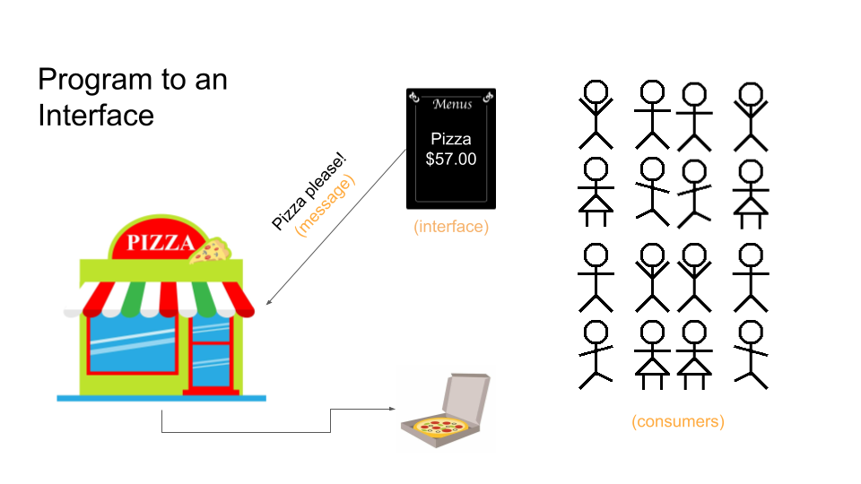

Welcome back! [Last time](), we discussed the basics of concerns in Ruby and saw a few examples of how to use them to share code across otherwise-unrelated sets of classes. We then took a detour with the goal of understanding, not just what concerns are, but also how to use them well. As part of that detour, we defined good software as, "software that can change inexpensively." We said that the concept of "inexpensive" encompassed a myriad of factors including time, money, and effort.

This led us to the following question:

> How do we build software in such a way that change is as inexpensive as possible?

We said that one way to do this is via the use of time-tested software design principles, aka. the topic of today's blog post.

Ultimately, we'll come full circle back to the topic of concerns in Ruby, but for now let's consider these software design principles. They tell us to write code that:

> 1. Has a single responsibility,
> 2. Is loosely coupled,
> 3. Relies on public interfaces, and
> 4. Makes appropriate use of composition, inheritance, and polymorphism.

Let's consider each of these in turn, and we're actually going to start with the last bullet point:

### Make Appropriate use of Composition, Inheritance, and Polymorphism

First, let's review some terminology:

#### Inheritance

Inheritance can be defined as an "is a" relationship and is useful when we need to relate objects in obvious hierarchies.

#### Composition

Composition can be thought of as a "has a" relationship, and we should reach for this tool when we need the functionality of a class but it doesn't make sense for us to be a relative of that class.

#### Polymorphism

We can think of polymorphism as a "behaves like a" contract, something we saw earlier when discussing concerns and said that they facilitate behavior sharing.

#### Visualizing Class Relationships

The following provides nice visualization for inheritance, composition, and polymorphism:



#### Use the Right Tool for the Job

Let's look at each of these from the perspective of a given class that we'll call `ClassA`.

Composition is a working relationship, where `ClassB` performs a function for our `ClassA`, but the class that performs this function can change over time. This is similar to a workplace, where anyone qualified can be a receptionist and the person performing that function can change over time. All we really care about is the receptionist functionality happening.

Polymorphism is similar, but whereas with composition we get a class to perform a function for us, with polymorphism we ourselves (`ClassA`) take on a role. We become the receptionist by asserting that we can do receptionist things and that anyone can treat us like a receptionist. We also feel right at home with others filling receptionist roles, laughing at the same jokes, reading the same industry publications, and griping about receptionist things.

With inheritance, the relationship between classes is much more formal. There is a direct lineage, and, while our parent might be a receptionist, no receptionist unrelated to us can be our parent. With inheritance, we are talking about a directly traceable genealogy from child to ancestor, not merely a role or function.

The key takeaways here are:

> 1. Thinking about the relationships among our classes yields high-quality designs.
>
> 2. Before you create relationships among classes, always be sure that you're using the right tool for the job.

Or in other words: Don't marry into a family if all you need is someone to water your houseplants and walk your dog for you while you're away on vacation. Having someone perform that function for you will work just fine, no formal affiliation needed!

### Write Code that Has a Single Responsibility

We could write an entire series of blog posts on any of these concepts, and "single responsibility" is no exception. In short though, this principle means exactly what it says: A well-designed class does one thing well.

This concept applies to methods too. A great way to create single-responsibility methods is to separate iteration and action into separate methods:

```ruby
# This method does too much!
def notify_users(users)
  users.each do |user|
    # send email
    # send push notification
    # add to report
    # ...
  end
end

# That's more like it!
def notify_users(users)
  users.each do |user|
    notify_user(user)
  end
end
```

At the end of the day, we can achieve single responsibility by having a Q&A with our code, asking it, "What do you do?" until we get an answer that indicates that our code is indeed focused on a single responsibility.

### Write Code that is Loosely Coupled

We achieve this by having our code only depend on things that change less often than we do. Examples of these types of things include public interfaces and APIs.

Additionally, our code should depend on behavior, not data or underlying data structures. We shouldn't know too much about the internal workings of the code that we interact with, instead keeping things on a more professional, public-interface-only level.

Finally, our code must itself be isolated such that it can change without consequence and be reused without duplication.

This leads nicely to...

### Program to an Interface, not an Implementation

Restaurants are a great example of this. Rather than popping into the kitchen to help the chef make your food, (most) restaurants provide a handy interface to their kitchen called a _menu_. Customers communicate with the kitchen via this shared interface, sending it messages with their desired menu items and (hopefully!) receiving them as-ordered from the kitchen.



When programming to an interface, we are doing the same thing that restaurant goers generally do: Asking for what we want, not telling how to do it.

But this fact highlights the importance of having a well-defined interface since _the interface determines what messages can be responded to_.

For example, a Chinese restaurant most likely does not list "breadsticks" as one of the messages that it knows how to respond to, any more than your local Italian restaurant can respond to a request for "fortune cookies."

### The Fundamental Design Question

Applying this mindset to our code, we can think of classes and methods much like restaurants. In the same way that, generally speaking, restaurants only understand the items listed on their menus, classes (or at least well-designed classes) only understand a certain set of messages sent to their public interface.

Interestingly, this thought experiment with restaurants is more than just a fun exercise. In her amazing book [_Practical Object-Oriented Design in Ruby_](https://www.poodr.com/), Sandy Metz writes:

> [The] transition from class-based design to message-based design is a turning point in your design career. The message-based perspective yields more flexible applications than does the class-based perspective.
>
> Changing the fundamental design question from, "I know I need this class, what should it do?" to, "I need to send this message, who should respond to it?" is the first step in that direction.

Let me highlight that last bit, just so we don't miss it:

> "I need to send this message, who should respond to it?"

If you think about it, this is actually a pretty common way of thinking:

> I want pizza; what restaurant should I order from?
>
> I could go for a hamburger; which joint should I stop at on my way home from work?

Applying this same logic to the code that we write looks something like:

> I need to sanitize this data; what class/method should I call?
>
> I need to log these metrics; what service can do that for me?

Furthermore, interacting with our code in this way checks all of the "clean coding" boxes we just discussed. Code that is designed to respond to a given set of messages:

- [x] Naturally lends itself to having a single responsibility,
- [x] Promotes loose coupling in an application by focusing on sending and responding to messages vs. underlying implementations, and
- [x] Encourages sending messages using public interfaces

Making appropriate use of composition, inheritance, and polymorphism in a message-based paradigm is an implementation detail. Recall that earlier we said,

> Thinking about the relationships among our classes yields high-quality designs.

We can frame relationships in terms of the messages passed between classes:

- Inheritance: We can respond to the same set of messages as our parent, adding new messages we want to respond to and customizing the responses.
- Composition: We send a message to the composed class asking it to perform a function for us. As long as the composed class can respond to the message we send, we are good!
- Polymorphism: A role can respond to a given set of messages. By playing a role, we gain the ability to respond to those messages too.

In reality, we can substitute the word "relationships" in the quote above and end up with an equally true axiom:

> Thinking about the _messages_ our classes can send and respond to yields high-quality designs.

### Driving the Point Home

To help us solidify this mindset, let's borrow a meme, but first some context:

<iframe width="560" height="315" src="https://www.youtube.com/embed/XxbJw8PrIkc?start=41" title="YouTube video player" frameborder="0" allow="accelerometer; autoplay; clipboard-write; encrypted-media; gyroscope; picture-in-picture; web-share" allowfullscreen></iframe>

Classic! Steve can help us out here too:


So, next time you sit down to write some code, consider chanting, "Messages, messages, messages," as a way to remind yourself of good software design principles.

### The Story so Far

That was a lot! Let's summarize what we've covered in this series so far and then take a step back and see where we're headed:

* In Ruby, concerns are a means for reusing code.
* We want to understand how best to use them, not just know what they are.
* To accomplish this, we zoomed out and discussed some general clean coding principles.
* In short, these clean coding principles led us to thinking about our code from the perspective of messages: "I need to send this message; who should respond to it?"
* We said that this mindset naturally lends itself to writing clean code.

The big takeaway here is:

> Thinking about the messages that our classes can send and respond to yields high-quality (i.e., inexpensively changeable) designs.

In the next post in this series, we're going to circle back to our discussion of concerns in Ruby and apply these lessons to the use of concerns, once again striving to understand, no just what they are, but also how best to use them.

We'll pick up here next time.
