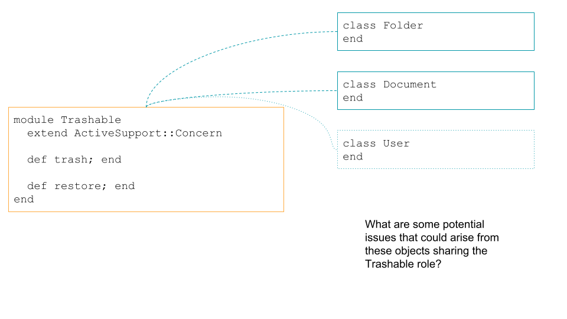
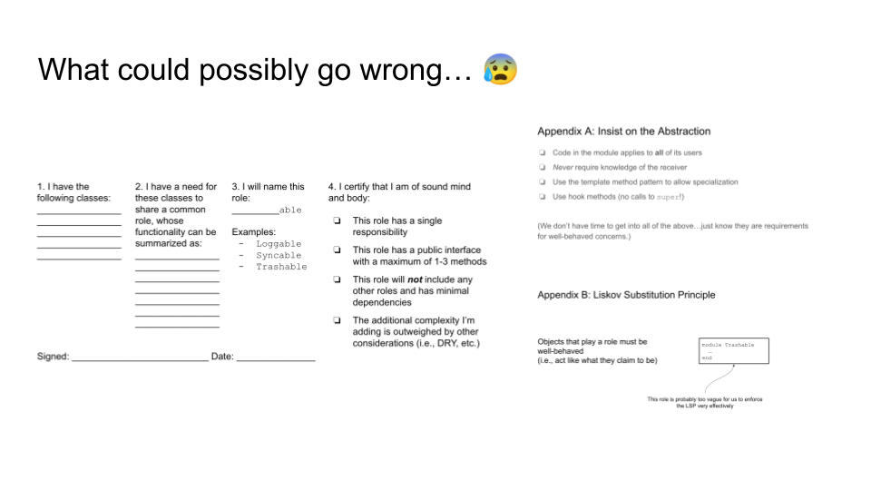

Welcome back! Here's the story so far.

In [part one](), we introduced concerns in Ruby. We looked at how they work and ended by saying that we wanted to go a bit deeper, understanding not just *what* concerns are but also *how to use them well*.

To do that, we took a bit of a detour in [part two]() and discussed a number of clean coding principles. We covered _a lot_ of ground in that post, but the big takeaway was:

> Thinking about the messages that our classes can send and respond to yields high-quality (i.e., inexpensively changeable) designs.

In this post, we are going to dig deeper into this message mindset and come full circle by relating it to how we use concerns in Ruby.

### Messages are Kind of the Point Anyway

Going back to our restaurant example from part two:


The major concept of this diagram is: If we want pizza and a restaurant can respond to the "pizza" message, that's really all we care about, isn't it? What matters isn't the steps used to prepare the pizza so much as getting a response of delicious, as-ordered pizza to our "Pizza please!" message. In other words,

> We mostly care about pizza-like behavior in response to our "Pizza please!" message.

And perhaps this emphasis on *behavior* seems familiar. Let's go back to our family fun park example from part one. You may recall this diagram:


Here, we are using a `Bookable` concern to share behavior among several otherwise unrelated classes. By including this concern, these classes can now behave like `Bookable` things...

In other words, we can now treat these classes like `Bookables`...

In other, _other_ words:
- We can now send these classes `Bookable` messages and
- They now know how to respond like `Bookables` are expected to.

`Bookable` concern = `Bookable` behavior.

### Acting Out

At the end of the day, given `ClassA` and `ClassB`, the only thing that `ClassA` really cares about is behavior: Whether or not `ClassB` responds to the message that `ClassA` wants to send to it.

This may bring to mind the famous saying:

> If it walks like a duck and talks like a duck, you can treat it like a duck!

This is a concept known as "Duck Typing":

> A "duck type" defines a **role** that **responds** to a given set of **messages** and is:
>
> - A **central location** for logic
> - **Adoptable** by any object that needs to play the role

Does the above definition for "duck type" sound familiar to anyone? Remember in part one when we defined what concerns are:

> Concerns are a mechanism for allowing an otherwise-unrelated set of classes to share code.

Well, here's another way of saying the same thing:

> Concerns are a mechanism for allowing an otherwise-unrelated set of classes to **play a role**.

We've been dancing around the issue, but let's just spell it out:

> By including a concern in our class...
>
> ***We are taking on duck type (aka. polymorphic) behavior!***
>
> (We are enabling our class to respond to all of the messages that the included concern understands.)

To put it another way:

```
Including a concern in our class
=
Saying that our class can respond
to a given set of messages
=
Duck type behavior
=
This is a "Behaves like a" contract
=
Which is the very definition of
Polymorphism!
```

Basically:

> ***Concerns are polymorphism in practice.***

### All Roads Lead to...
Remember earlier when we took a detour? It was to get here, where we can say:

> A ***concern*** allows a ***class*** to play a ***role*** via ***polymorphism***.

When you think about "playing a role," hopefully now, thanks to our detour, you immediately realize that doing so means responding to all of the messages that the role understands:

> A class that includes a concern takes on a role and is now able to respond to all of the messages that the concern understands.

In fact, the statement, *"You included a concern and now your class can respond to a new set of messages,"* isn't just a cool observation. Remember that this is polymorphism we're talking about. And polymorphism is a **contract** that your class will behave a certain way.

### Catching Our Breath

This is a lot! To summarize what we've discussed so far:

1. We want to write good code.
1. We defined "good code" as code that can change inexpensively.
1. Message-based designs are inexpensively changeable.
1. Thus, message-based design is our goal.
1. This means that, when creating software, we want to think about our code in terms of the messages that get sent and who is responsible for responding to them.
1. When we include a concern in our class, we enable our class to respond to all of the messages that the concern understands.
1. This is not optional. Concerns enable duck typing in the classes that include them, which means these classes have taken on polymorphic behavior and must now adhere to a "behaves like a" contract.

### So You Want to Include a Concern?
This leads us to probably the number one bad practice or misuse when it comes to concerns. You've probably seen it:

> Developer needs to accomplish a task and thus needs some functionality.
>
> Developer notices that a concern has a method or methods that have said functionality.
>
> Developer includes concern in class.
>
> Boom - done, right?

Hopefully, you're shaking your head "no." Because what has this developer just done? More than just add functionality, right? They've actually added polymorphic behavior to this class by giving it the concern's role. The class is now expected to properly respond to every message that the concern (the new role) understands.

But is this what the developer intended to do? No! They just wanted functionality, not for their class to take on an entire role. In this case, the developer knows what concerns are but doesn't understand how to properly use them. Hopefully, now you won't be that developer!

### And They all Lived...
It would be nice if we could end the story here, but if you've been in software for any length of time and had to work with concerns, then you know that there's more to the story since concerns are very easily abused and can quickly lead to inscrutable code.

To help illustrate the minefield that we're wading through, here is some real-world footage of developers trying to use concerns:


Just kidding. Mostly. In all seriousness though, there's more to talk about here and we would be remiss not to.

### Finding the Foot Guns
Let's talk about the foot guns inherent in using concerns. We've actually already unearthed one which we might as well make explicit:

> Footgun #1: Concerns are misused when they are included for their functionality and not because we want our class to play a role.

Remember: Including a concerns obligates your class to play the concern's _entire_ role. Since you're taking on polymorphic behavior, you must now adhere to a "behaves like a" contract.

---

For our next foot gun, recall that earlier when discussing the importance of messages we said that it's a good idea to ask, "Who is responsible for responding to this message?"

Well, consider this diagram:


Above, we can see how a message-based view of things pretty quickly uncovers the latent complexity in this architecture. Also, recall when we compared the diagram of inheritance to that of concerns and said that the relationship/dependency created by using a concern is much less explicit than that created when using inheritance, which leads us to:

> Footgun #2: Using concerns increases the accidental complexity of an application.

Here, the term "accidental complexity" is borrowed from the excellent book [_Code Complete_](https://www.oreilly.com/library/view/code-complete-2nd/0735619670/) and simply means "avoidable complexity."

In short, when writing software, some complexity is inherent to what we're doing and is thus unavoidable. However, some complexity gets added in due to the choices that we make, and we call this accidental complexity, i.e., the complexity that we should seek to avoid and/or minimize as much as possible.

Thus, if using concerns increases the complexity of our application but there's another, less-complex approach that we could use, we would be wise to use it instead.

### It Doesn't End There...
Consider this diagram:


All is well and good until the brand new dev on the team gets assigned a ticket to allow `users` to be deleted and now suddenly our code looks like this:



From a high-level view, there's really no role that it makes sense for files/folders and users to share. We can use a concern to give them `Trashable` functionality, but what we are after is *functionality*, not a role, which means a concern isn't the correct tool to use here.

To summarize this problem:


> Footgun #3: Only take on roles that make sense for your class to play!

### TL;DR
You're probably surprised to read this in a blog post about concerns, but really the TL;DR from my years writing software is:

> Don't use concerns.

I'm not saying that polymorphism/duck typing is bad, but rather that concerns are an error-prone implementation of these concepts. The main reason for their error-proneness?

> When using concerns, 100% of the onus is on the individual developer to use them correctly.

Now, one may well counter, "But doesn't this apply to pretty much everything about programming?" Kind of, but I'd argue that concerns are a special case because the real question isn't, "Can this thing be misused", but rather, "How easy or difficult is it to spot misuses?"

Take inheritance for example. Misuses of inheritance are much more obvious due to the inherent hierarchical nature of inheritance. Also, inheritance is a much easier concept to understand than polymorphism. Thus, on the continuum of simple vs. complex and easy vs. difficult to understand, concerns/polymorphism fall in the category of "complex and difficult to understand."

So, seriously…

> Don’t use concerns!

If you have to use them:

> Try something else first!

OK, if you really must...


We here at Maxwell have come up with this handy template we have our developers fill out any time they want to use a concern:



What could possibly go wrong, right?

But perhaps there's a better way. Maybe there exists *something* that will allow us to reap some of the same benefits as concerns without the drawbacks.

Spoiler: There is! And this concept will be subject of the final blog post in this series.

See you next time!
